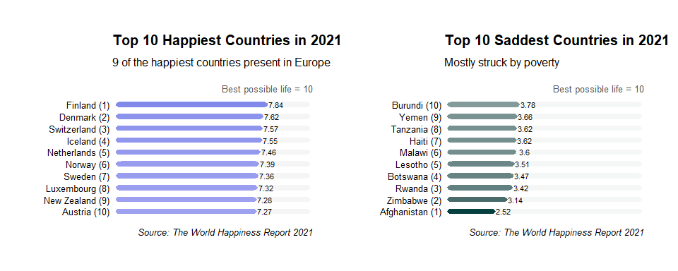
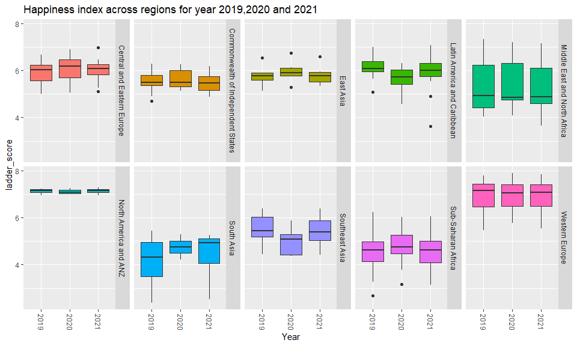
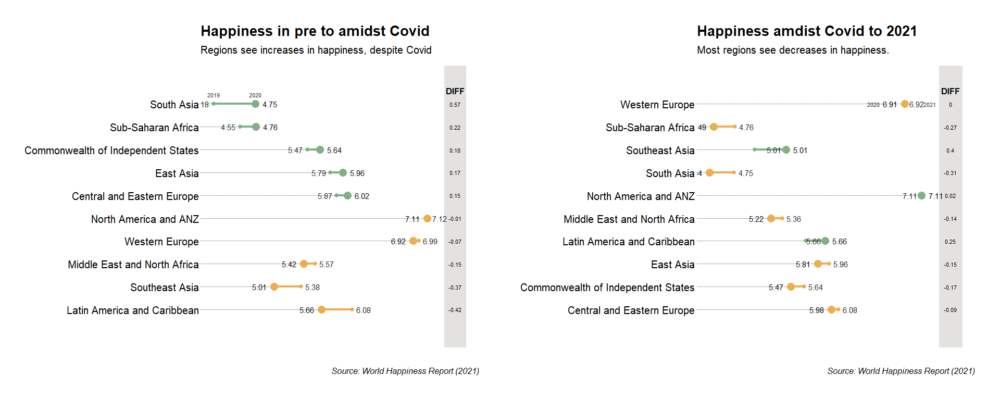
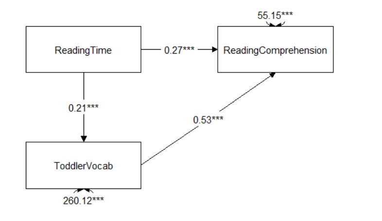
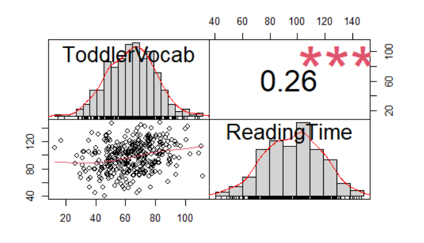
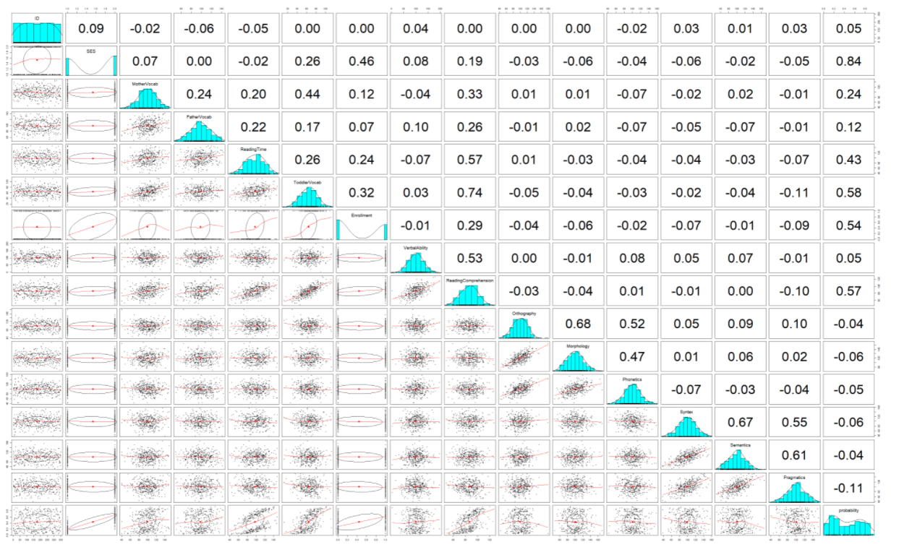
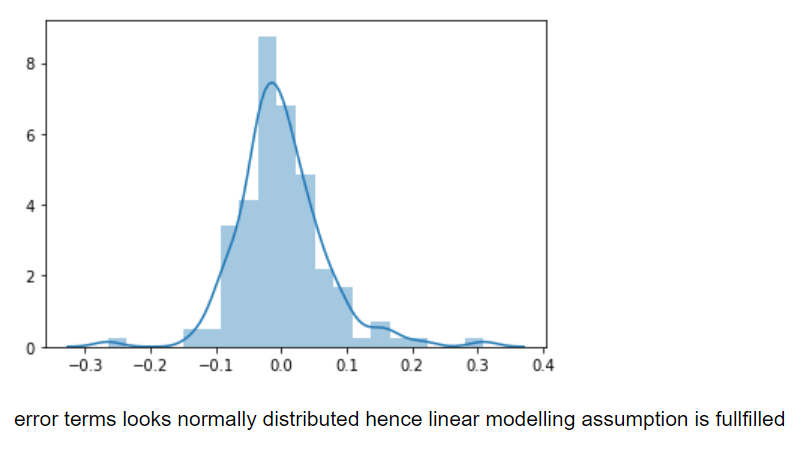

# Farzana Patel
 Data Scientist| Psychologist| Data Consultant
 
# Experience
* OFFICE FOR NATIONAL STATISTICS, UK - Data Scientist (Senior Executive Officer)
* OMDENA, REMOTE- Junion Machine Learning Engineer
* MARUMA CONSULTANCY, INDIA- Lead Consultant (Data and Analysis)
* ACCENTURE, INDIA- Application Development Associate
 
# Education
* MSC (Psychological Reaserach Methods with Data Science), The University of Sheffield, UK.
* Post-Grad Diploma (DataScience specialization in Deep Learning), IIIT- Bangalore, India.
* MA (Psychology), IGNOU, India.
* BE (Computer Engineering), MITCOE, India.

# Languages and Technological skills
 Python | R | Git | PowerBI | Tableau | SPSS | SQL 
 ETL | Data science pipeline | Statistics | Time series | Experimental design | Hypothesis testing | ML | NLP | Deep Learning

# [Project 1: World Happiness Report 2021](https://farz1313.github.io/farzana_patel_psy6422/)

This project integrates various visulizations pertaining happiness scores across the globe along with other important parameters.
* **R libraries used:** Plotly, Renv, Dplyr, Tidyverse, Ggalt
* **Input:**  Country, Year, Happiness Score, Regions
* **Output:** Happines trend during Covid.
* **Key Insight:** There was significant dip in happiness levels across the globe when Covid struck and it didn't go back to original levels in 2021.
   
   
   

# [Project 2: Credit Card Fraud Detection](https://github.com/farz1313/Farz-Projects/tree/main/DS%20Projects/Capstone%20Project)

This project predicts fraudulent credit card transactions using machine learning models.
* **Python libraries used:** LogisticRegression, roc_auc_score, RandomForestClassifier,KMeans
* **Input:**  Vectors, Amount, Class
* **Output:** Recall scores were used to identify best model based on their performance.
* **Key Insights:** Random forest is the best performing model and KNN performed the worst. So, I recommend using random forest to identify fraud transactions with current class imbalance dataset


# [Project 3: Advanced Statistics- Investigation of knowledge and skill development in a lifetime](https://rpubs.com/FarzanaPatel/adv_stats)

In this project, I investigated how people develop skills and knowledge throughout their lifetime. In particular, I investigated how language exposure impacts later linguistic skills, cognitive abilities, and academic achievement. The goal was to make several models, which quantify and test postulated theoretical assumptions.
Previous studies in language acquisition showed that language skills depend on the richness of the environment as well as number of other factors. In the case of this exam, I focused on the question of how people learn language and whether this influences other outcomes, such as university enrollment.

* **R libraries used:** tidySEM, lavaan, statmod, semPlot, rcompanion, lme4, lmerTest, sjPlot, glmmTMB
* **Input:** item_id, WordType, MotherVocab, FatherVocab, ReadingTime, ToddlerVocab, RT 
* **Models used:** Linear Model, Structural Equation Model (SEM), Generalized Linear Model, Confirmatory Factor Model, Mixed Effect Model
* **Key Insights:** 
    - Toddler with mother with larger vocabulary will know 0.32 words more than the toddler with mother with smaller vocabulary, by every 1 unit increase in mother’s vocabulary and keeping all other variables constant. Slope of ReadingTime increases by 0.175596 for toddler from high SES background. That is toddlers from high SES background have high positive relationship between ReadingTime and ToddlerVocab as compared to low SES background toddlers.
    - Prediction of university enrollment: SES was significant (β=2.129449, p= 2.58e-14). Hence, null of no effect is rejected. So, it can be stated that, SES measure is predictive of enrollment.ReadingTime was significant (β= 0.027840, p= 4.80e-05). Hence, null of no effect is rejected. So, it can be stated that, ReadingTime measure is predictive of enrollment.ToddlerVocab was significant (β= 0.025196, p= 0.0029). Hence, null of no effect is rejected. So, it can be stated that, ToddlerVocab measure is predictive of enrollment.It can be stated that high SES individuals are 8.41 times more likely to enroll at a university.

**SEM Model output:**  


**Generalized Model prediction:**  


**Full GLM prediction:**  
  

# [Project 4: Car Price Prediction](https://github.com/farz1313/FarzProjects/blob/main/DS%20Projects/Machine%20Learning/Car%20Price%20Prediction/car%20price%20assignment.ipynb)

An automobile consulting company wants to understand the factors on which the pricing of cars depends.The model prediction will be used by management to understand the pricing dynamics of a new market.
* **Python libraries used:** LinearRegression, RFE, sm 
* **Input:**  Car price, car types, car specifications
* **Output:** Linear model that explains the most variance with significant predictors.
* **Key Insights:** Linear model fits the best here with 90% variance explained by r-squared(0.899) and adjusted r-squared (0.896).P-values of the model is less than 0.05 which validates that predictors are statistically significant

**Scatterplot of all numeric datapoints:**  


**Residual plot:**  


**Linear Model prediction:**  


<hr>
<p align="center">
  <i>Let's connect and chat! Open to anything under the sun.</i>

  <p align="center">
    <a href="https://www.linkedin.com/in/farzanapatel/" alt="Linkedin"></a>
    <a href="mailto:pfarzana1313@gmail.com" alt="Contact me"></a>
<hr>
<!--
```markdown
Syntax highlighted code block

# Header 1
## Header 2
### Header 3

- Bulleted
- List

1. Numbered
2. List

**Bold** and _Italic_ and `Code` text

[Link](url) and 
```

For more details see [GitHub Flavored Markdown](https://guides.github.com/features/mastering-markdown/).
-->
