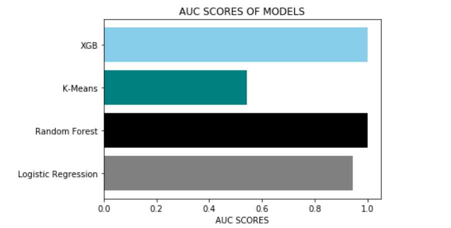
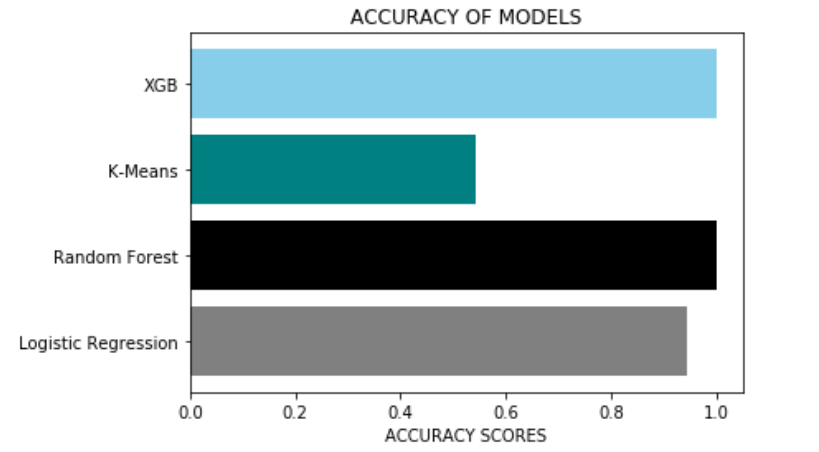
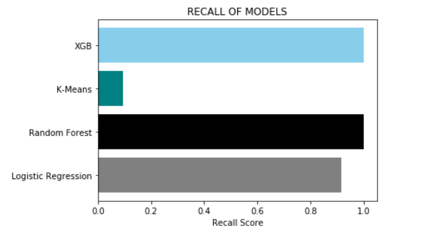

# Farzana Patel
* An aspiring Data Scientist| Psychologist| Statistician

# Education
* MSC (Psychological Reaserach Methods with Data Science), The University of Sheffield, UK.
* Post-Grad Diploma (DataScience specialization in Deep Learning), IIIT- Bangalore, India.
* MA (Psychology), IGNOU, India.
* BE (Computer Engineering), MITCOE, India.

# [Project 1: World Happiness Report 2021](https://farz1313.github.io/farzana_patel_psy6422/)

This project integrates various visulizations pertaining happiness scores across the globe along with other important parameters.
* **R libraries used:** Plotly, Renv, Dplyr, Tidyverse, Ggalt
* **Input:**  Country, Year, Happiness Score, Regions
* **Output:** Happines trend during Covid.
   
   
   

# [Project 2: Credit Card Fraud Detection](https://github.com/farz1313/Farz-Projects/tree/main/DS%20Projects/Capstone%20Project)

This project predicts fraudulent credit card transactions using machine learning models.
* **Python libraries used:** LogisticRegression, roc_auc_score, RandomForestClassifier,KMeans
* **Input:**  Vectors, Amount, Class
* **Output:** Recall scores were used to identify best model based on their performance.






```markdown
Syntax highlighted code block

# Header 1
## Header 2
### Header 3

- Bulleted
- List

1. Numbered
2. List

**Bold** and _Italic_ and `Code` text

[Link](url) and 
```

For more details see [GitHub Flavored Markdown](https://guides.github.com/features/mastering-markdown/).

